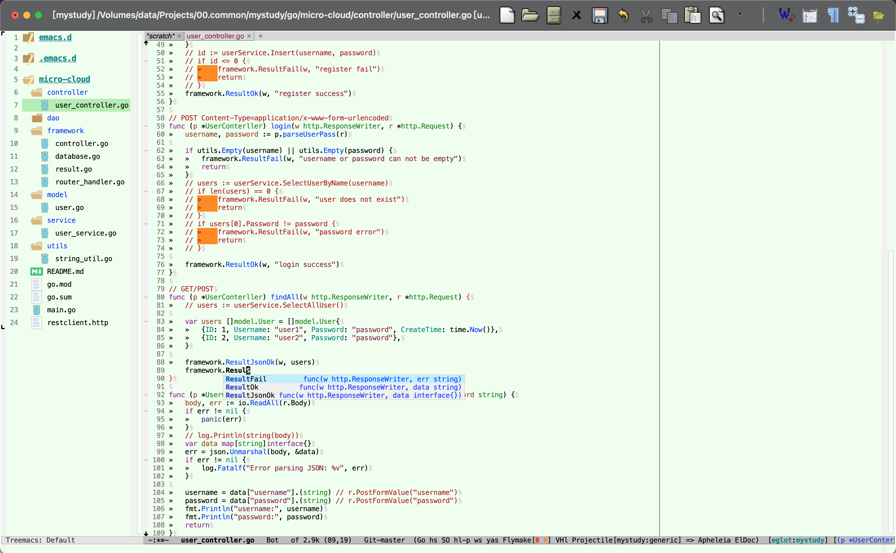

# Liu Xin's Emacs Configuration

这是 [Liu Xin](mailto:meteor1113@qq.com) 的 Emacs 配置。

## Features

- 使用 `init-loader.el` 按模块加载配置，模块位于 `lisp/`、`lisp/progmodes/` 和 `lisp/textmodes/`。
- 使用 `package.el` 配合 `use-package` 管理插件，插件默认从 MELPA 安装并保持更新。
- 使用 Vertico、Consult、Orderless、Marginalia、Corfu 和 YASnippet 提供补全与搜索体验。
- 使用 Eglot 和 Flymake 提供语言服务器集成及即时诊断。
- 集成 Projectile、Treemacs、Magit、ibuffer-projectile、Avy、Eat 和 Popper 等工具。
- 支持 C/C++、C#、Emacs Lisp、GDB、Go、Java、JavaScript、Perl、PHP、Python、Rust、Shell、SQL、Terraform、Markdown、Org 和 XML。

## Installation

需要 Emacs 29 或更高版本。

```sh
git clone https://github.com/meteor1113/emacs.d.git ~/.emacs.d
```

根据需要可拷贝`etc/sample/emacs-custom.el`到`~/.emacs.d/emacs-custom.el`。

启动 Emacs 后，`init-elpa.el` 会启用 MELPA，并通过 `use-package-always-ensure` 自动安装缺失的插件。首次启动需要网络连接；之后可重新启动 Emacs 完成剩余初始化。

## Directory Layout

- `bin/`：保存第三方可执行文件(Windows)。
- `lisp/`：保存配置模块及其他 Emacs Lisp 文件。
- `etc/images/`：保存工具栏使用的图标。
- `etc/sample/`：保存示例文件。

## External Tools

根据使用的功能，建议提前安装并加入 `PATH`：
- Git、`ripgrep`（项目搜索和 Projectile）。
- 对应语言的编译器或运行时。
- 对应语言服务器（Eglot）和 Flymake 使用的诊断工具。
- Rust 的 `cargo`、`rustfmt`；Go 的工具链；Python 的 Ruff。

## Screenshot


